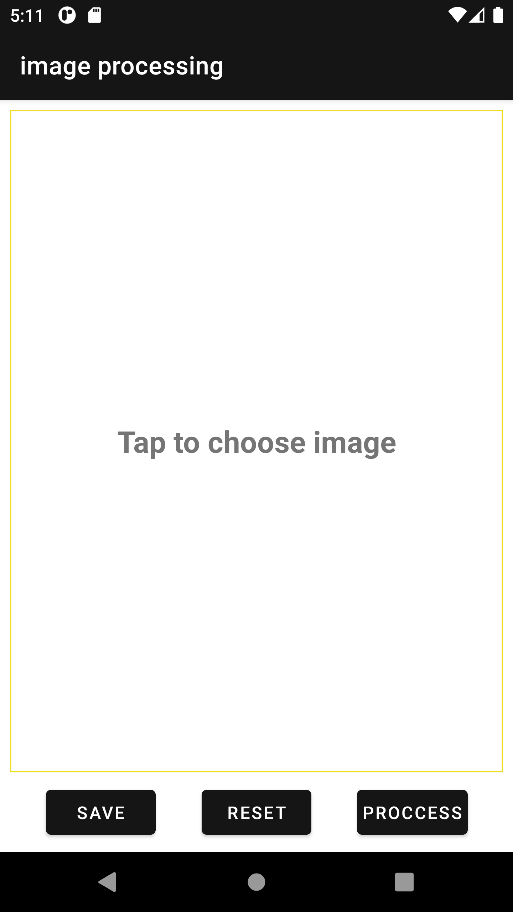

# Experimenting with the OpenCV implementation on native Android

Using OpenCV on Android thanks to [Quickbird Studios](https://quickbirdstudios.com/) implementation.

## Things I've learned

- Writing image files
- Permission handling
- Interaction with Gallery

## Things to improve

- UI definitely needs a redesign.
- Apply dependency inversion.
- Implement camera interaction.

### Dependencies

* OpenCV by [Quickbird Studios](https://quickbirdstudios.com/).

`implementation 'com.quickbirdstudios:opencv:4.5.3.0'`

* [Glide](https://github.com/bumptech/glide) for efficient bitmap writing.
